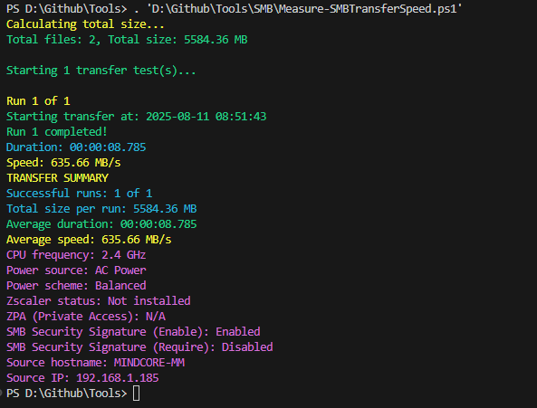
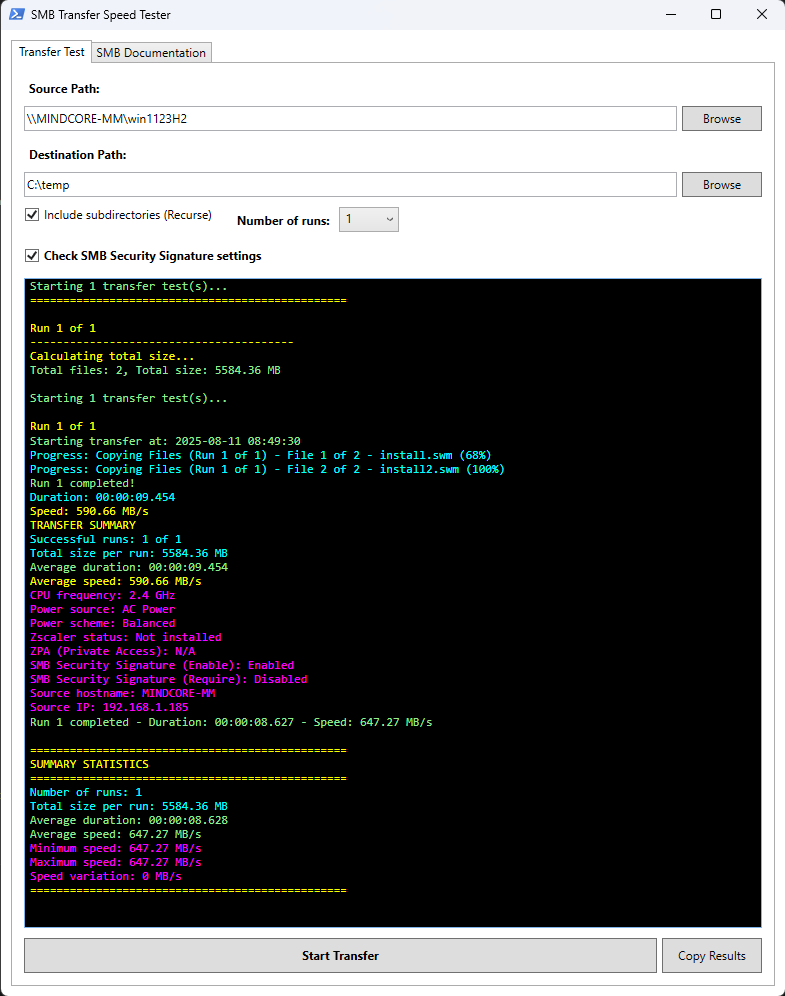
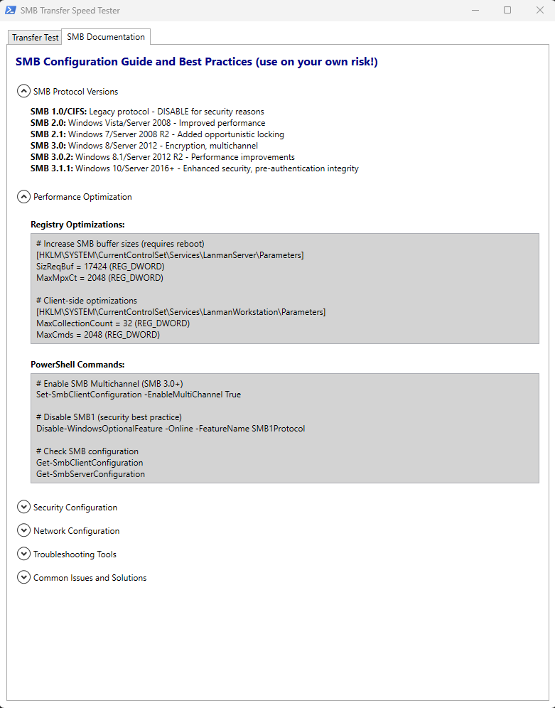

# Measure-SMBTransferSpeed

[](#requirements) [](#requirements) [](#license)

## Overview
PowerShell tool to measure SMB (Server Message Block) file transfer speeds while collecting key system and network diagnostics. Run via CLI or a simple WPF GUI to copy files and capture throughput, CPU frequency, power settings, Zscaler status, DNS, and more. Generates clear progress and a concise report.

## Features
- Real-time transfer speed and per-run statistics
- CLI and WPF GUI modes
- System and network diagnostics (CPU freq, power, DNS, Zscaler status)
- Robust validation and error handling
- Works with local and UNC paths, optional recursion

## Requirements
- Windows PowerShell 5.1 or PowerShell 7+
- .NET Framework 4.5+ (for GUI)
- SMB access permissions; admin may be required for some queries

## Install
- Clone or download the repository
- Unblock the script if needed:
    ```powershell
    Unblock-File .\Measure-SMBTransferSpeed.ps1
    ```
- Ensure execution policy allows running local scripts:
    ```powershell
    Set-ExecutionPolicy -Scope CurrentUser RemoteSigned
    ```

## Quick Start
- CLI (recursive copy, multiple runs):
    ```powershell
    .\Measure-SMBTransferSpeed.ps1 -SourcePath "\\server\share\folder" -DestinationPath "C:\Temp\SMBTest" -Recurse -Runs 5
    ```
- GUI:
    ```powershell
    .\Measure-SMBTransferSpeed.ps1 -ShowGUI Yes
    ```

## Parameters
- SourcePath: Source files (local or UNC). Required unless using GUI
- DestinationPath: Destination folder (auto-created). Required unless using GUI
- Recurse: Include subdirectories
- ShowGUI: Yes to launch WPF interface (default No)
- Runs, Buffer sizes, and other tuning switches if provided by the script

## Example Usage
- Measure with recursion and multiple runs:
    ```powershell
    Measure-SMBTransferSpeed -SourcePath "\\server\share\folder" -DestinationPath "C:\temp" -Recurse -Runs 1
    ```
    
- GUI preview:
    ```powershell
    .\Measure-SMBTransferSpeed.ps1 -ShowGUI Yes
    ```
    
    

## Output
- Console/GUI progress with speeds and totals
- Summary of transfer stats (size, duration, average/peak throughput)
- System/network snapshot: CPU frequency, power plan, Zscaler/VPN status, DNS resolution
- Any errors and skipped items

## Tips and Troubleshooting
- Prefer a local destination to avoid measuring network twice
- Close bandwidth-heavy apps and pause antivirus for consistent results
- Use admin PowerShell if system queries are denied
- Verify share permissions and path reachability
- For GUI, ensure .NET Framework 4.5+ is available

## Credits
Acknowledgements for development, testing, and input:
- [Bo Bertelsen](https://www.linkedin.com/in/bertelsenbo/)
- [Michael Sonne](https://www.linkedin.com/in/michaelmsonne/)

## Notes
- File: Measure-SMBTransferSpeed.ps1
- Author: Mattias Melkersen
- Version: 1.0.0## Contributing
a feature branch, submit a PR
## Learn More
- PowerShell documentation: https://learn.microsoft.com/powershell/
- Fork, create a feature branch, submit a PR
- Open issues for bugs and enhancements

## License
MIT License

Copyright (c) 2025 Mattias Melkersen

Permission is hereby granted, free of charge, to any person obtaining a copy
of this software and associated documentation files (the “Software”), to deal
in the Software without restriction, including without limitation the rights
to use, copy, modify, merge, publish, distribute, sublicense, and/or sell
copies of the Software, and to permit persons to whom the Software is
furnished to do so, subject to the following conditions:

The above copyright notice and this permission notice shall be included in
all copies or substantial portions of the Software.

THE SOFTWARE IS PROVIDED “AS IS”, WITHOUT WARRANTY OF ANY KIND, EXPRESS OR
IMPLIED, INCLUDING BUT NOT LIMITED TO THE WARRANTIES OF MERCHANTABILITY,
FITNESS FOR A PARTICULAR PURPOSE AND NONINFRINGEMENT. IN NO EVENT SHALL THE
AUTHORS OR COPYRIGHT HOLDERS BE LIABLE FOR ANY CLAIM, DAMAGES OR OTHER
LIABILITY, WHETHER IN AN ACTION OF CONTRACT, TORT OR OTHERWISE, ARISING FROM,
OUT OF OR IN CONNECTION WITH THE SOFTWARE OR THE USE OR OTHER DEALINGS IN
THE SOFTWARE.